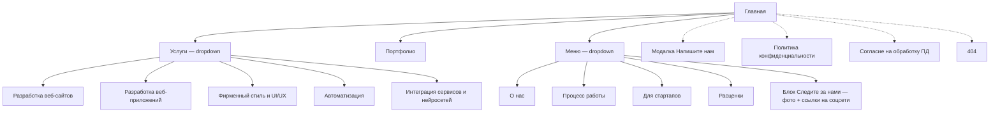

## Итоговая карта сайта

### 1. Список страниц (12 шт.)

- Главная
- Услуги — Разработка веб-сайтов
- Услуги — Разработка веб-приложений
- Услуги — Фирменный стиль и UI/UX
- Услуги — Автоматизация
- Услуги — Интеграция сервисов и нейросетей
- Портфолио
- О нас
- Процесс работы
- Для стартапов
- Расценки
- Политика конфиденциальности (юр.)
- Согласие на обработку персональных данных (юр.)
- 404 (служебная)

Дополнительно сквозные элементы: модальное окно «Напишите нам» и баннер cookie-уведомления (рекомендуется при сборе ПД).

### 2. Хедер (sticky)

- Логотип Геккодио (ссылка на Главную)
- Услуги — dropdown со ссылками на 5 страниц услуг
- Портфолио — прямая ссылка
- Меню — dropdown:
  - Блок «Следите за нами» — не отдельная страница, а визуальный блок внутри дропдауна: фото/изображение + подпись + иконки-ссылки на соцсети и мессенджеры (внешние ссылки, открываются в новой вкладке)
  - О нас
  - Процесс работы
  - Для стартапов
  - Расценки
- Кнопка «Напишите нам» — открывает модальное окно с формой

### 3. Композиция Главной (сверху вниз)

1. **Hero** — оффер и CTA
2. **Кто мы, почему мы** — объединённый блок: кратко о компании + ключевые преимущества (скорость low-code, цена, сроки, подход)
3. **Наши услуги** — сетка из 6 карточек:
  1. Разработка веб-сайтов
  2. Разработка веб-приложений
  3. Фирменный стиль и UI/UX
  4. Автоматизация
  5. Интеграция сервисов
  6. Интеграция нейросетей
    рточки 5 и 6 визуально разделены на две, но обе ведут на одну и ту же страницу услуги — «Интеграция сервисов и нейросетей». Остальные карточки ведут на свои 4 страницы услуг.
4. **Используемые сервисы и технологии** — стек low-code / no-code / AI (логотипы инструментов)
5. **Как мы работаем** — этапы процесса (ссылка на полную страницу «Процесс работы»)
6. **Наши проекты** — превью портфолио (3–6 лучших проектов со ссылкой на раздел «Портфолио»)
7. **Отзывы клиентов**
8. **«Обсудим проект»** — короткий контрастный CTA-блок (без полей формы): заголовок + кнопка-дубль «Напишите нам», открывающая ту же модалку, что и в хедере
9. **FAQ**
10. **Футер**

Блок «Для стартапов» на Главной не размещаем — это отдельная страница, доступная из меню (и как карточка/CTA на подходящих местах по ходу дизайна).

### 4. Раздел «Портфолио»

- Сетка кликабельных карточек без внутренних детальных страниц кейсов
- Каждая карточка ведет на живой сайт клиента (внешняя ссылка) либо открывает лёгкую модалку-превью — уточнить при дизайне

### 5. Страницы услуг (5 шт., единый шаблон)

Единая структура для всех пяти страниц, чтобы обеспечить консистентность и SEO:

- Hero услуги (название, короткий оффер, CTA)
- Кому подходит / задачи, которые решаем
- Что входит в услугу
- Этапы работы
- Примеры проектов из портфолио по этой услуге
- Инструменты и сервисы, с которыми работаем
- Ориентировочные сроки и цены (или ссылка на «Расценки»)
- Форма заявки / CTA

### 6. Остальные страницы меню

- **О нас** — история, миссия, команда, ценности, цифры
- **Процесс работы** — подробные этапы от брифа до поддержки
- **Для стартапов** — оффер MVP за N недель, спецпредложение, кейсы стартапов, форма
- **Расценки** — тарифы/пакеты по услугам, калькулятор или вилки цен, что влияет на стоимость

### 7. Футер

- Дубль навигации (Услуги, Портфолио, разделы меню)
- Контакты (email, телефон)
- Соцсети и мессенджеры
- Мини-CTA «Обсудить проект» с кнопкой
- Копирайт с годом
- Ссылки на Политику конфиденциальности и Согласие на обработку ПД (требование 152-ФЗ)

### 8. Точки захвата лидов

Единая модальная форма, вызываемая из всех CTA на сайте (имя, контакт, короткое описание задачи, чекбокс согласия на ПД):

- Кнопка «Напишите нам» в хедере (на всех страницах)
- Блок «Обсудим проект» на Главной (контрастный CTA перед FAQ) — дубль кнопки «Напишите нам»
- CTA на каждой из 5 страниц услуг
- CTA на странице «Для стартапов»
- Мини-CTA в футере
- Чекбокс согласия на обработку ПД обязателен во всех вариантах формы (152-ФЗ)

### 9. Служебное

- Страница 404 в фирменном стиле с навигацией назад
- После отправки формы — уведомление о успешной отправке (можно сделать на той же странице, отдельная страница «Спасибо» не выбрана, но рекомендуется для аналитики — опционально)
- Cookie-баннер (рекомендуется при использовании аналитики)

### 10. Карта сайта (визуально)




### 11. Технологический стек реализации

Сайт будет реализован на чистом **HTML + CSS + JavaScript** (без Next.js / React).

**Почему этого достаточно:**

- Контент статический, 12 маркетинговых страниц — фреймворк не нужен.
- Нативный JS закрывает всё: dropdown-меню, модалка «Напишите нам», FAQ-аккордеон, карусель отзывов, анимации скролла, валидация формы.
- SEO работает нативно — HTML индексируется без SSR-обвязки.
- Хостинг на любом статическом: Netlify, Vercel (static), Beget, Reg.ru, GitHub Pages.
- Скорость загрузки выше, чем у React-сайта сопоставимого объёма.

**Организационные решения для HTML/CSS/JS:**

- **Исключение дублирования хедера и футера** на 12 страницах — подгрузка через `fetch()` + вставка в `<div id="header"></div>` / `<div id="footer"></div>` при загрузке страницы. Альтернатива — минимальный сборщик (Vite) с HTML-партиалами, если захотим «красиво».
- **Структура проекта:**
  - `index.html` (Главная)
  - `/services/websites.html`, `web-apps.html`, `branding-ui.html`, `automation.html`, `ai-integrations.html`
  - `portfolio.html`, `about.html`, `process.html`, `startups.html`, `pricing.html`
  - `privacy.html`, `consent.html`, `404.html`
  - `/partials/header.html`, `footer.html`, `modal.html` — переиспользуемые куски
  - `/assets/css/`, `/assets/js/`, `/assets/img/`, `/assets/fonts/`
- **Форма заявки** — отправка через сторонний сервис-приёмник (Formspree / Getform / Web3Forms) либо через Telegram Bot API прямо из JS. Собственный бэкенд не требуется.
- **Обязательно:** чекбокс «Согласен с обработкой ПД» со ссылкой на страницу согласия — в каждой форме.
- **Аналитика:** Яндекс.Метрика (цели: отправка формы, клик по «Напишите нам», клик по соцсетям).

**Next.js не используем** — по решению владельца проекта и по причине избыточности для маркетингового сайта такого объёма.

### Что дальше

После подтверждения плана можно переходить к:

- детальной проработке вайрфреймов по каждой странице,
- выбору сервиса-приёмника формы (Formspree / Telegram-бот и т. п.),
- определению фирменного стиля и визуальной системы,
- последующей реализации сайта в режиме агента на HTML/CSS/JS.

```markdown
## Фирменные цвета

| Цвет | HEX | Роль |
|---|---|---|
| Белый | `#FFFFFF` | Основной фон |
| Графит | `#1E1E1E` | Основной текст |
| Пурпурный | `#6B2EE5` | Primary — CTA, логотип, акценты |
| Салатовый | `#AAFF3F` | Подсветка слов в Hero, highlights |
| Жёлтый | `#FFFF00` | Точечные акценты, стикеры |
| Коралловый | `#EB5143` | Ошибки формы, дополнительные акценты |
```

